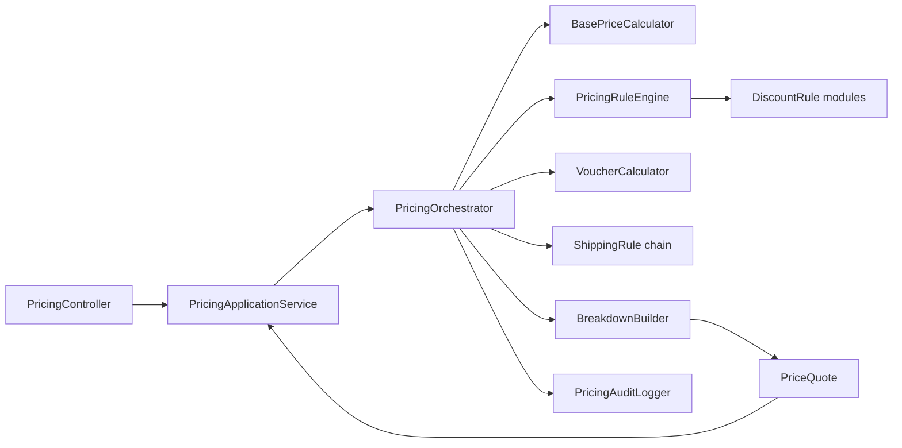
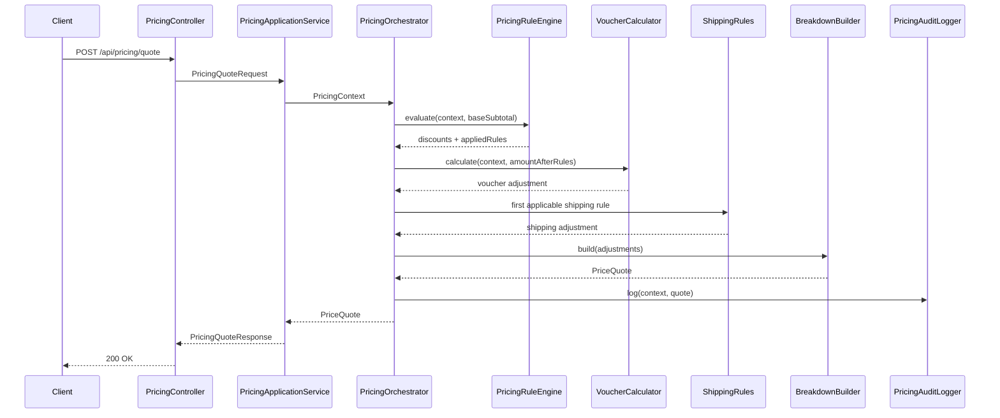

# Pricing Rule Engine Architecture

This document explains how the pricing service is wired today: request flow, rule execution, and why results stay deterministic and explainable.

## 1) Goal and Constraints
- Deterministic pricing pipeline for checkout use cases.
- Explainable response with typed adjustments and decision trail.
- Modular extension points for rules and calculators without changing orchestration core.
- In-process modular monolith (not distributed microservices).
- Architecture choices prioritize maintainability of rule logic and clear ownership boundaries, which aligns with practitioner and pattern guidance [R1], [R6].

## 2) Core Pricing Flow
1. Receive cart pricing request (`POST /api/pricing/quote`).
2. Build `PricingContext`.
3. Compute base price adjustments.
4. Apply discount rules in priority order.
5. Apply voucher module.
6. Apply shipping module.
7. Build quote breakdown and final total.
8. Emit audit log with decision trail.

## 3) High-Level Components
- `PricingController`: HTTP boundary.
- `PricingApplicationService`: DTO <-> domain mapping.
- `PricingOrchestrator`: deterministic sequence controller.
- `PricingRuleEngine`: rule evaluation for discount rules.
- Calculation modules:
  - `BasePriceCalculator`
  - `VoucherCalculator`
  - `ShippingRule` implementations
- `BreakdownBuilder`: computes totals from typed adjustments.
- `PricingAuditLogger`: logs pricing decisions.

## 4) Architecture Diagram

## 5) Deterministic Pipeline Sequence

## 6) Adjustment Model
All monetary effects are represented as `PriceComponent` with `AdjustmentType`:
- `BASE`
- `DISCOUNT`
- `SHIPPING`

This provides a single explainable model for UI, support, reconciliation, and audits.

## 7) Determinism and Auditability
Determinism comes from:
- immutable `PricingContext` input,
- fixed sequence in `PricingOrchestrator`,
- rule ordering by priority in `PricingRuleEngine`,
- pure value-object arithmetic via `Money`.

Auditability comes from:
- `appliedRules` in the quote,
- `decisionTrail` in the quote,
- structured log output in `PricingAuditLogger`.

## 8) Design Pattern Matrix (Pricing Context)
The system follows Rules Engine guidance from DevIQ [R6] and lines up with rule-loop and decoupling ideas discussed in pricing-engine writeups [R5].

| Pattern | Where in this codebase | Why it is used in pricing |
|---|---|---|
| Rules Engine Pattern | `PricingRuleEngine` + `DiscountRule` | Centralizes rule evaluation and decouples business rules from orchestration and transport layers. |
| Strategy | `DiscountRule`, `ShippingRule`, `VoucherCalculator` implementations | Each pricing behavior is swappable and independently testable. |
| Chain of Responsibility | `PricingOrchestrator.evaluateShipping()` iterating `ShippingRule` list | Shipping is first-match by business priority with deterministic fallback behavior. |
| Orchestrator (Mediator-style coordination) | `PricingOrchestrator` | Keeps sequence control in one place and prevents rule/calculator modules from coupling to each other. |
| Value Object | `Money`, `PriceComponent`, `PriceQuote`, `PricingContext` | Protects arithmetic invariants and makes pricing outputs immutable and reproducible. |
| Aggregate Root | `Cart` owning `CartItem` | Enforces cart-level invariants and central subtotal logic. |
| Anti-Corruption Layer | `PricingApplicationService` | Isolates HTTP DTO contracts from domain model evolution. |
| Open/Closed Principle (SOLID) | Rule/calculator interfaces + Spring component discovery | New pricing logic is added by new modules, not by editing orchestration core. |

### 8.1) DevIQ Rules Engine Guidance Mapped to This Design
- DevIQ highlights three parts: engine, rules collection, and input context [R6].
  This maps to `PricingRuleEngine`, `DiscountRule` modules, and `PricingContext`.
- DevIQ recommends replacing long `if` stacks with composable rules [R6].
  This design does that by moving conditional pricing logic into rule classes.
- DevIQ recommends SRP and KISS for each rule [R6].
  Each rule module has one concern (for example VIP discount, free shipping threshold).
- DevIQ notes the engine should own ordering/filtering/aggregation logic [R6].
  Here, priority and exclusive/stackable behavior are enforced in `PricingRuleEngine`.

### 8.2) Practitioner Guidance Mapping
- Build-vs-buy is a first-order concern for pricing platforms and long-term total cost [R1].
- Rule systems should remain extensible because pricing inputs and business constraints evolve quickly [R1], [R4].
- Price lifecycle governance (constraints, rounding, review/approval) is a practical requirement in production pricing operations [R3].
- Expert-system style pricing frameworks typically separate knowledge/rules from inference/processing components, which aligns with this engine/module split [R2].

## 9) Rule Processing Model
### Discount Rules
- Produces `DISCOUNT` adjustments.
- Evaluated in descending priority.
- Supports exclusive vs stackable discounts (`isStackable`).

### Voucher Module
- Evaluated after discount rules on the current amount.
- Produces optional `DISCOUNT` adjustment.

### Shipping Module
- Evaluated after discount phase.
- First applicable shipping rule wins.

## 10) Current Scope vs Future Scope
### In scope
- Deterministic in-process pricing.
- Explainable typed adjustments.
- Modular rules/calculators with extension interfaces.
- Pricing audit logs and decision trail.

### Intentionally not included
- External rule authoring or remote rule runtime.
- Carrier live-rate integration.
- Event-sourced pricing history.

## 11) How to Extend Safely
1. Add a new module implementation (rule or calculator interface).
2. Keep module focused on one responsibility.
3. Emit only valid adjustment types for the module domain.
4. Add/adjust tests for deterministic totals and breakdown.
5. Do not change `PricingOrchestrator` ordering unless business flow changes.

## 12) References
- [R1] Reddit: [How to develop a pricing engine?](https://www.reddit.com/r/ProductManagement/comments/1bc5fwp/how_to_develop_a_pricing_engine/)
- [R2] ResearchGate: [Price engine framework](https://www.researchgate.net/figure/Price-engine-framework_fig1_346121360)
- [R3] Reactev: [Price Management Software](https://www.reactev.com/price-management-software)
- [R4] 7Learnings: [How to implement dynamic pricing?](https://7learnings.com/blog/how-to-implement-dynamic-pricing/)
- [R5] Medium: [An interesting system design of a rule engine prototype](https://medium.com/@snowmanjy/an-interesting-system-design-of-a-rule-engine-prototype-29255e87b377)
- [R6] DevIQ: [Rules Engine Pattern](https://deviq.com/design-patterns/rules-engine-pattern/)
